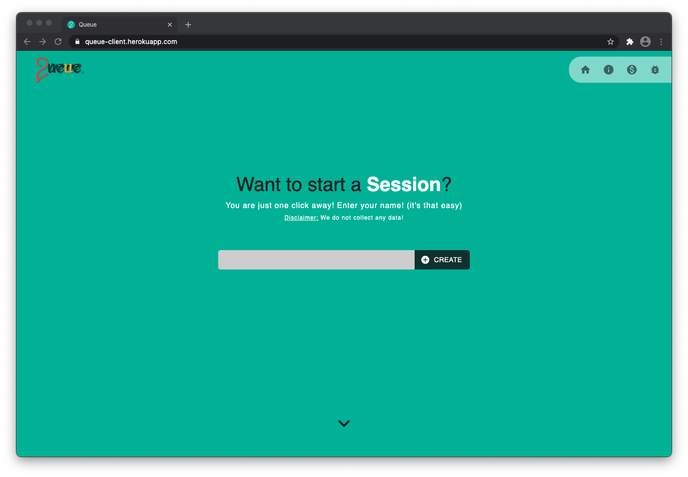
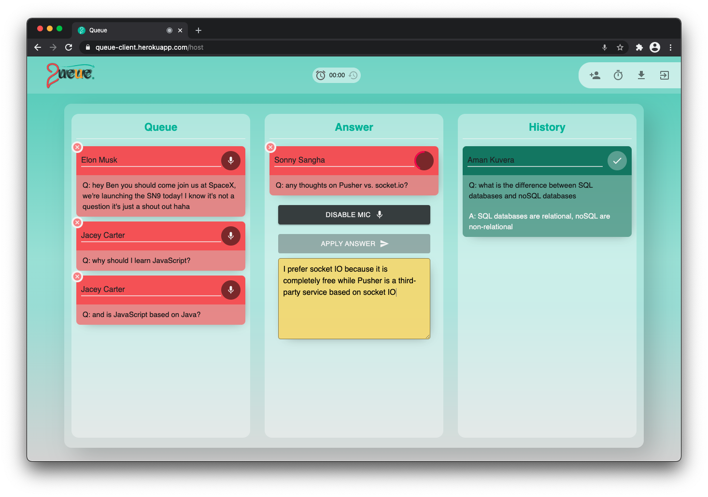
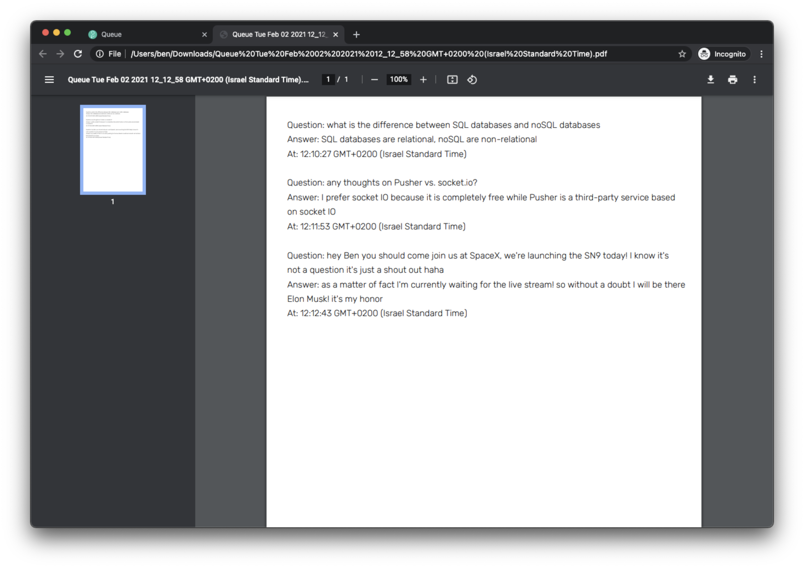
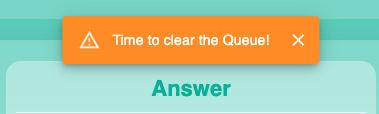
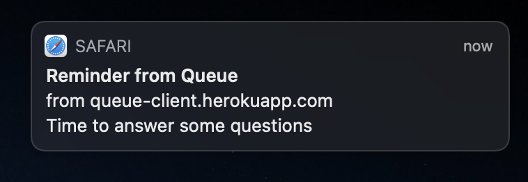

# Queue: [click to open app](https://queue-client.herokuapp.com)

###### • Home page

###### • Session dashboard

###### • Download a PDF of the session history

###### • Easy invite

###### • Optional timed notifications

###### • Mobile friendly

 
 
 
 
 

## Technologies used:

- [React.js](https://reactjs.org)
- [Redux](https://redux.js.org)
- [Node.js](https://nodejs.org/en/)
- [socket.io](https://socket.io)
- [MongoDB](https://www.mongodb.com)
